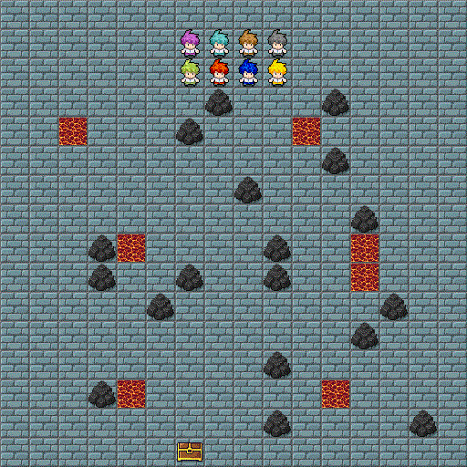

Implementation of the Deep Q-Learning approach for multi-agent systems. 
The goal is to ensure that each agent has a distinct policy compared to every other agent. 
Our objective is to encourage diverse policies among these agents, even if they are not optimal.
The emphasis lies in fostering cooperation among agents while acknowledging and embracing the diversity in their individual decision-making strategies.

# Algorithm

# Environment
Our environment is a square grid of size n x n that can contain p agents. Each agent
has five possible actions:

# Evaluation
8 agent train on a 16x16 map

